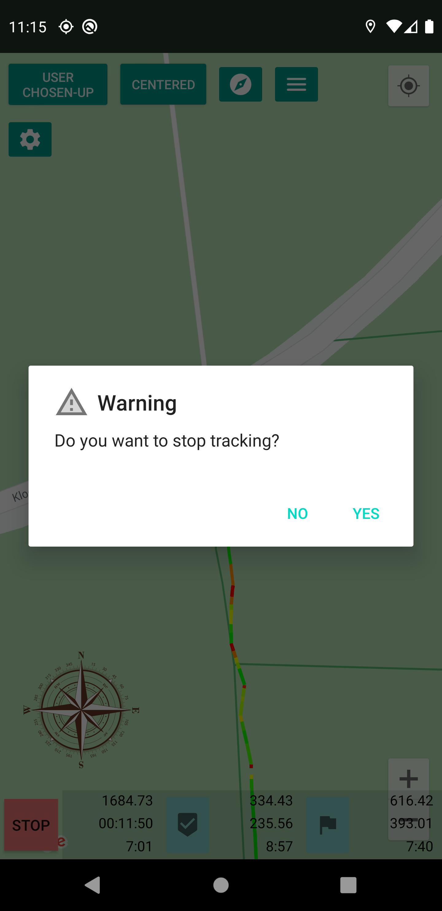
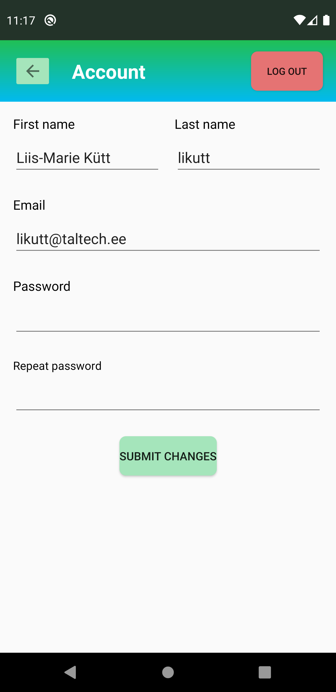

# SportMaps App - Android

#### App that helps to navigate and train in unknown terrain. App is based on Google Maps and built-in GPS functionality.

Features:
* Controlling the app from lock screen.

* Toggling of "keep map constantly centered", "keep north-up / direction up / user chosen-up".

* Setting checkpoints (permanent) and waypoints (single) on track.

* On-screen real compass is provided.

*  Direct and travelled distance from start, last checkpoint and last waypoint are calculated and displayed. Also time elapsed from start, overall pace (in minutes per km) in every three sections.

* Track segments are gradient colored according to speed, both in old and current session.

* Track segment coloring is easily user configurable - per active session and also in every past session separately.

* All sessions and checkpoints are saved to the database.

* View, rename and delete old sessions.

* Session export possibility as email attachment. File format - gpx.

* Configuring GPS update frequency.

* GPS location coordinates are filtered, obvious wrong coordinates are filtered out.

* Creating an account in backend server and location updates are synced realtime to backend during active session (https://sportmap.akaver.com/)

* Configuring syncing interval in options (ala when received, once in 10 sec, once in 30 sec, etc..).

 

Tracking started (portrait) | Tracking started (landscape)
------------ | ------------- 
 | 

Custom notification |
------------ |
 |

Stopping tracking | Track after
------------ | -------------
 | 

Menu | Settings 
------------ | ------------- 
 | 

Account - logged in | Account - Register | Account - Login 
------------ | ------------- | -------------
 |  | 

Sessions history - not logged in | Sessions history - logged in | Sessions history - logged in syncing
------------ | ------------- | -------------
 |  | 

Old session - view | Old session - edit | Old session - export | Old session - delete
------------ | ------------- | ------------- | -------------
 |  |  | 

Screenshots from Pixel 3 XL